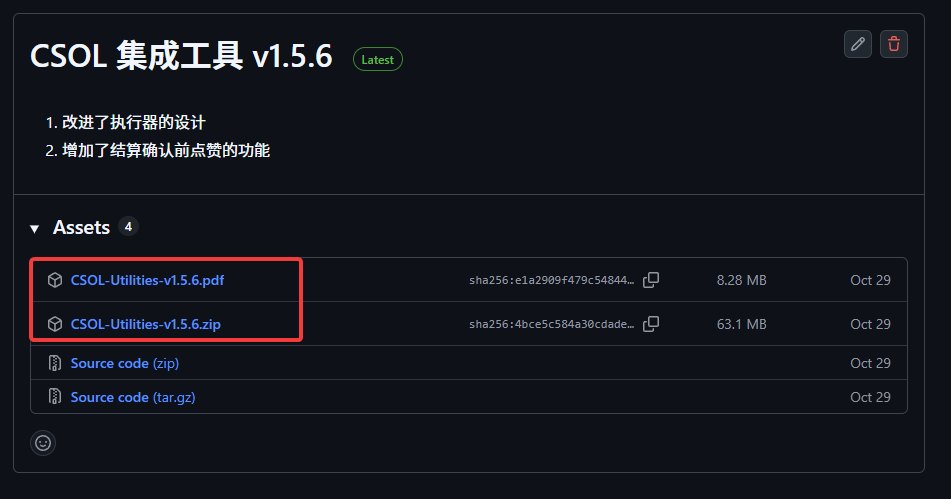

# CSOL 集成工具

功能强大且高度自定义的 CSOL 集成工具，含 24 H 转圈（无需罗技设备）、商店批量购买、配件批量合成等功能。

## 运行环境要求

- Windows 10 / 11
- <b style="color:red">无需任何罗技设备！</b>
- Logitech G Hub 最新版

## 功能概述

- **24 H 自定义武器挂机（支持防卡黄金僵尸奖励）**
- **挂机掉线自动重连**
- **配件自动合成**
- **商店自动重复购买**
- **支持多区服挂机**

## 说明

视频简介：[【CSOL 集成工具 v1.5.4 简介】](https://www.bilibili.com/video/BV1xyxgzWEiL/?share_source=copy_web&vd_source=ecf11699925deac30da81ec78c8ec602)

**本软件使用 CC BY-NC 4.0 开源协议，请尊重作者劳动。为防止二次传播，详细构建流程不予公开。作者不会主动向您索取任何费用，请注意甄别。**

B 站 ID：_CoreDump

作者邮箱：admin@macrohard.fun（回复较为及时）、ttyuig@126.com

本工具原本专为 24H 挂机设计，后经过大量重构和版本迭代，在增强 24H 挂机功能的基础上，提供了更多更为丰富的功能。如有任何问题或意见和建议，欢迎通过上述方式与我联系。

**创作不易，若觉得本工具有用，可以给个 Star 支持一下，谢谢！亦可在 [配置面板](https://www.macrohard.fun/CSOL-Utilities/panel/) 进行赞助。**

### 工具及使用手册下载

- 在[GitHub 发布页面](https://github.com/UserNameUnavailableIsUnavailable/CSOL-Utilities/releases)中下载最新版本。
- [配置面板](http://www.macrohard.fun/CSOL-Utilities/panel)中也提供了下载链接。

通过 GitHub 发布页面下载时，下载压缩包（.zip）和使用手册（.pdf）即可，不要下载源代码。

## 主要功能概览

有关各功能的详细说明，请参阅发布页面提供的使用手册，并在 [配置面板](http://www.macrohard.fun/CSOL-Utilities/panel) 中进行相应的配置。

### 24 H 挂机

提供两种挂机模式，分别采用独立的武器列表挂机：

- 默认挂机模式
- 扩展挂机模式

两种挂机模式功能上并无功能上的区别，但默认挂机模式是掉线重连后的默认模式（即便掉线前使用的是扩展挂机模式），进入游戏后，先使用默认模式进行挂机，经过两分钟左右时间积攒足够资金后后才切换为扩展模式。因此，建议默认模式采用较为保守的武器列表设定（如 24 H 纯近战房间），扩展挂机模式则使用更加灵活的武器列表设定（无限制房间）。

游戏正常运行情况下<b style="color:red">近乎无差错选定 T / CT 阵营角色</b>。

因网络拥塞、游戏漏洞等问题（维护等特殊情况除外）导致游戏进程意外终止后，<b style="color:red">自动重连并创建新房间（支持房间上锁防止举报等恶意行为）继续挂机</b>。

因各种原因（如被强制踢出房间）离开房间后能<b style="color:red">自动创建新房间继续挂机</b>。

### 配件自动合成

制造所自动合成配件功能，需提前输入仓库密码。

### 商店自动重复购买

自动批量购买金币道具，如期限金币角色用于探索升级。

## 开发者文档

有一定编程经验的用户，可阅读 [CSOL 集成工具开发者文档](https://blog.macrohard.fun/CSOL-Utilities/) 了解更多详细信息（已经过时，由于个人精力有限，还需一段时间才能更新）。