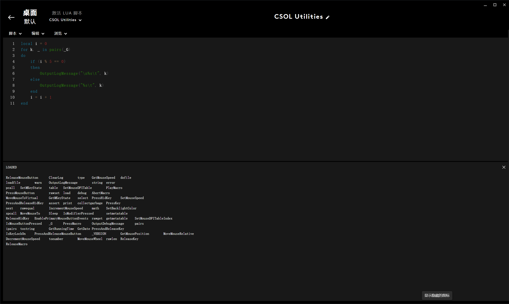

# 设计概述

CSOL-Utilities 共分为控制器（Controller）和执行器（Executor）两部分。控制器使用 C++ 实现，执行器使用 Lua 实现。执行器运行于 Logitech G Hub 控制器运行后，实时向 `$~cmd.lua` 写入命令，执行器定期从 `$~cmd.lua` 中取出命令并解释执行。因此，执行器的行为由控制器决定。

## 设计思路

罗技软件提供的编程接口是**事件驱动**的，当鼠标点击、键盘击键等事件发生时，通过回调 `OnEvent` 函数响应事件。但是，罗技提供的编程接口只支持响应如下类型的事件：

|事件|描述|
|---|---|
|"PROFILE_ACTIVATED"|配置文件被激活|
|"PROFILE_DEACTIVATED"|配置文件被停用|
|"G_PRESSED"|罗技设备上的 G 键（按钮）被按下|
|"M_PRESSED"|罗技设备上的 M 键（按钮）被按下|
|"G_RELEASED"|罗技设备上的 G 键（按钮）被释放|
|"M_RELEASED"|罗技设备上的 M 键（按钮）被释放|
|"MOUSE_BUTTON_PRESSED"|鼠标按钮被按下|
|"MOUSE_BUTTON_RELEASED"|鼠标按钮被释放|

这意味着除了罗技设备上的独有的 G 键和 M 键，罗技软件只会在鼠标按钮被按下和释放时进行回调（不考虑配置文件激活和停用）。这样的回调要求实际上非常苛刻，在集成工具的 `legacy` 版本（2023.11 开发）中，我通过在回调时检查键盘锁定键（`NUM_LOCK`、`CAPS_LOCK`、`SCROLL_LOCK`）的状态组合进行状态切换，但不论如何，使用上均非常不便。

不过，罗技 G Hub 除了提供罗技 Lua API 手册中提及的 API，还有一部分 API 未作为编程接口提供，但我们可以通过一些方法把它们都罗列出来。Lua 编程中有一个很重要的概念是 `_G` 表，表中存储了所有的全局符号。

```lua
local i = 0
for k, _ in pairs(_G)
do
    if (i % 5 == 0)
    then
        OutputLogMessage("\n%s\t", k)
    else
        OutputLogMessage("%s\t", k)
    end
    i = i + 1
end
```



其中，我们重点关注一个名为 `dofile` 的符号。在 Lua 标准中，`dofile` 用来加载一个 Lua 模块（Lua 源文件）并运行，这一点与 C/C++ 中的 `#include` 预处理符号很相似。因此，一个很自然的想法就产生了：使用 `dofile` 从一个外部文件中取命令并解释执行，这个命令应当由一个外部控制器下达。如果你被计算机组成原理支配过，这一点应该对你而言似曾相识。控制器就有点像 CPU 中的 **CU（control unit，控制单元）**，存放命令的文件就相当于 CPU 中的 **IR（instruction register，指令寄存器）**，而执行器就相当于 CPU 中的 **ID（instruction decoder，指令译码器）**[^1]。这样，执行器的状态和行为就由控制器完全地确定了，并且使得执行器摆脱了对罗技 GHub 编程框架事件驱动模型的依赖。

[^1]: 仔细类比的话实际上还是有一些不同的，这仅仅只是一个帮助大家理解例子。

此外，`dofile` 还为我们带来了一个额外的好处，我们可以像 C/C++ 中那样，把整个 Lua 源程序分割为若干个模块。

我们可以像下面这样，实现一个与 C/C++ 中的语义差不多的 `Include`：

```lua
PATH = "C:/Users/Silve/Develop/CSOL-Utilities/source/Executor/"
function Include(file_name)
    if (type(file_name) == "string")
    then
        dofile(PATH .. file_name)
    end
end
```

要定义一个单独的模块，首先创建一个 Lua 源文件，例如：`module.lua`，然后在其中编写如下代码：

```lua
if not module_lua
then
    module_lua = true

    module = {
        -- anything
    }

end -- module_lua
```

假定阅读本篇文档的读者都写过一点 C/C++，那么看到上面的代码应该立刻就会想到 C/C++ 中的 “include guard”，用于防止一个文件被重复包含，这里的含义也是一样的。

```C++
#ifndef MODULE_HPP
#define MODULE_HPP
class Module
{
    // anything
}
#endif // MODULE_HPP
```