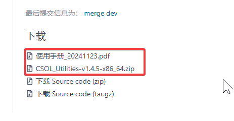

# CSOL 集成工具

## 运行环境要求

- Windows 10/11
- Logitech G Hub 最新版<b style="color:red">（无需任何罗技设备）</b>

## 功能概述

- **24 H 自定义武器挂机**
- **挂机掉线自动重连**
- **配件自动合成**
- **商店自动重复购买**

## 说明

目前，仅支持国服挂机（目前暂未收到支持其他区服挂机的需求）。

**本软件使用 CC BY-NC 4.0 开源协议，请尊重作者劳动。**

B 站 ID：_CoreDump

作者邮箱：ttyuig@126.com

项目中的 C++ 及 Lua 源码完全公开并附以完善注释，供参考交流。
为防止二次传播，本仓库不提供从源码构建的方法及使用手册的 $\LaTeX$ 源代码。
本工具原本专为 24H 挂机设计，后经过大量重构和版本迭代，在增强 24H 挂机功能的基础上，提供了更多更为丰富的功能。如有更好的功能性建议，欢迎通过上述方式与我联系。

### 工具及使用手册下载

- gitee 下载链接：👉👉👉<a href="https://gitee.com/silver1867/csol-24-h/releases">点此下载</a>👈👈👈
- GitHub 下载链接：👉👉👉<a href="https://github.com/UserNameUnavailableIsUnavailable/CSOL-Utilities/releases">点此下载</a> 👈👈👈

国内用户请通过 gitee 下载如下内容（工具压缩包及使用手册），<b style="color:red">下载时不要下载源代码</b>，使用时请仔细阅读手册。

## 主要功能概览

### 24 H 挂机

提供两种挂机模式：

- 一号模式：购买自定义配件武器，并使用自定义的武器挂机，适合单人锁房挂机和 24H 纯刀房挂机；
- 二号模式：购买并使用具有特殊功能的武器（如圣翼皓印），使用自定义的武器挂机，对于部分武器（如万钧神威）提供专门设计的挂机代码，详见使用手册。

游戏正常运行情况下<b style="color:red">无差错选定 T/CT 阵营角色</b>。

因网络拥塞、游戏漏洞等问题（维护等特殊情况除外）导致游戏进程意外终止后，<b style="color:red">自动重连并创建新房间（支持房间上锁）继续挂机</b>。

因各种原因（如被强制踢出房间）离开房间后能<b style="color:red">自动创建新房间继续挂机</b>。

### 配件自动合成

制造所自动合成配件功能，需提前输入仓库密码。

### 商店自动重复购买

自动批量购买金币道具，如期限金币角色用于探索升级。

### 游戏工具

- 支持将游戏窗口无边框化，调满分辨率即可实现无边框窗口全屏。与传统全屏不同，无边框全屏能够正常显示输入法侯选框；
- 其他功能（如强制最小化窗口、阻止鼠标指针移出游戏窗口等），详见 <a href="https://gitee.com/silver1867/gaming-tool">GamingTool 使用说明</a>。

> 注意：该工具已经合并到集成工具压缩包中，无需额外下载。

# 捐赠（自愿）

本项目用爱发电，如您感觉本项目对您有帮助，可以点点 star 支持一下，也欢迎向作者捐赠，让作者更新更有动力 😃😃😃。

